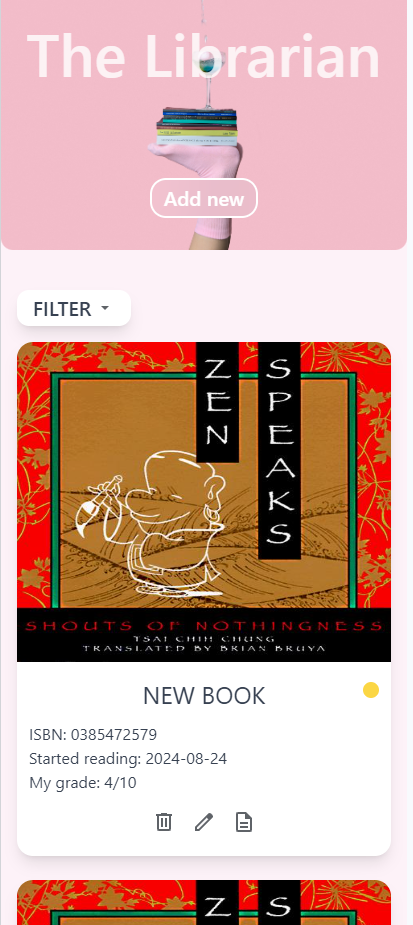
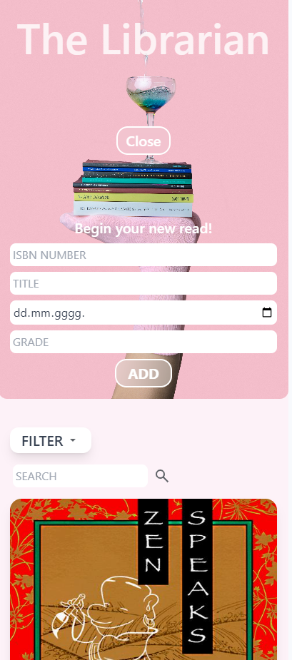
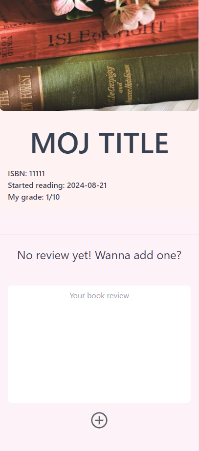

# BASIC JS BOOK APP WITH PERSISTENT STORAGE

---

Your book diary! Keep track of books you have read, give them grades and reviews!
Simple JS project using Express JS and Tailwind CSS, serves as a step up with introduction of permanent storage via PostgreSQL.
A new mini capstone to test my knowledge with addition of databases.

---

## How to use ?

1. Use git clone to copy the repository
2. Navigate to /src folder in terminal and run

```bash
npm i
```

3. Create PostgreSQl database by using provided querys in /sql, and setup your .env
4. Run node ./index.js
5. App is available on localhost:3000

## App images

<div align="center">
 


</div>
